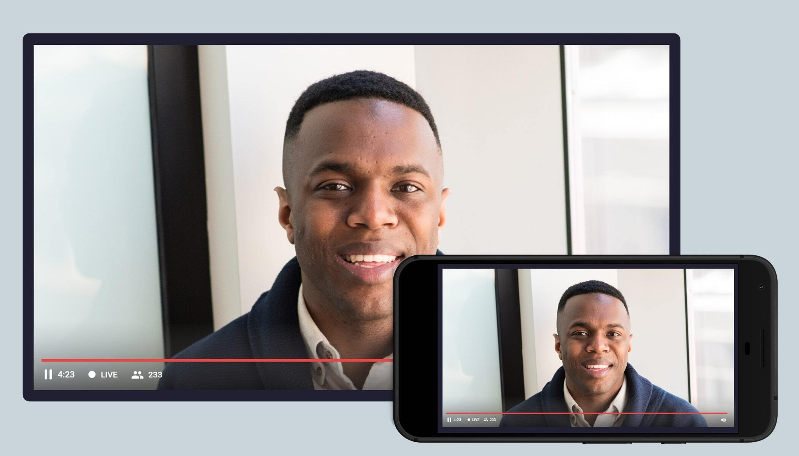

# Video SDK live streaming react api example

This code sample demonstrates a [Video Live Streaming API](https://docs.videosdk.live/docs/overview/live-streaming/introduction) using react js.

- Built for serverless live broadcasting experience.
- Scale it up to millions of the channels and users at the same time.
- Supports live playback
- Easy to connect with any social media live streaming API.
- Low latency across the globe.



## Features

- [x] RTMP support for live streaming.
- [x] Commpatible with OBS studio, Streamyard etc.
- [x] Adaptive live streaming based on screen resolution and internet bandwidth.
- [x] Record your live streaming for playback.
- [ ] Private streaming with authentication.
- [ ] Embeded live streaming player.

## Device support

Visit our official [documentation](https://docs.videosdk.live/docs/live-streaming/intro) for more information.

## Prerequisites

You must have the following installed:

- Node JS
- NPM

## Running the Authentication server

Follow [videosdk-rtc-nodejs-sdk-example](https://github.com/videosdk-live/videosdk-rtc-nodejs-sdk-example) to run authentication server.

## Running the app

To run the app, first install the dependencies and then run the server.

```sh
$ npm install
$ npm start
```

For more information, visit [official documentation](https://docs.videosdk.live/docs/live-streaming/intro)
